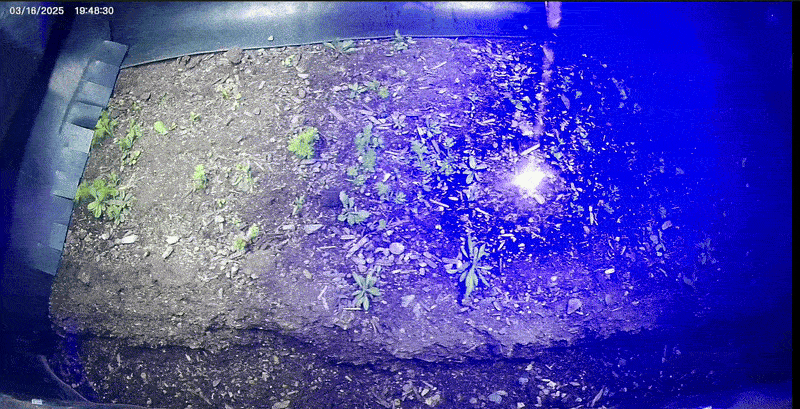

# Q3ube L&ASER

## Open source Agtech silicon and a laser weeder for all farmers, big and small

We are the Q3ube collective. If you so freely choose, your unique and technological
distinctiveness will be assimilated into our collective Civilization Critical SDK.

With great thanks to Laudando and Associates, we have assimilated the open source
release of the L&ASER product into the Q3ube directed energy weeding (DEW) patent
portfolio.

Feel free to modify, remix, and reproduce the work we share with you.

Please note that the following trademarks are property of their respective owners.
To be a part of the collective, you must bring your own creativity and intelligence
to manifesting your own identity.

"L&ASER"
"7 Elements Solar Tractor"
"Resistance will be litigated"

  

    <a href="https://www.laudando.com/fight" target="_blank">Click here to join the fight!</a>
  

